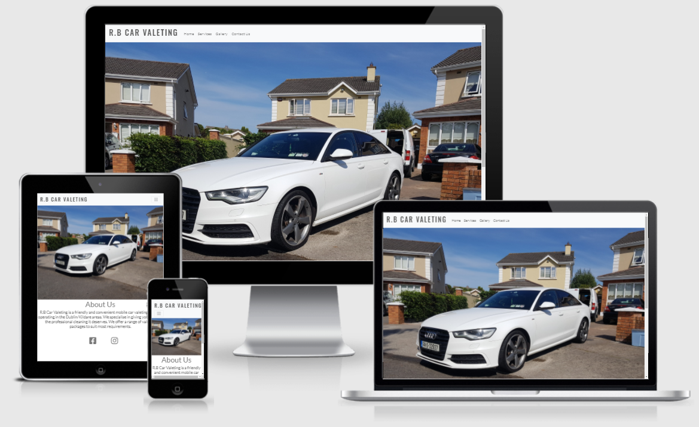

# Purpose #
This website was created for my First Milestone Project for The Code Institutes Full Stack Developer Course. It was built using HTML & CSS which I learned from the HTML, CSS & User Centric Frontend Modules. 

### Live link can be found here: https://johnbyrne963.github.io/1st-Milestone-Project/ 

# RB Car Valeting Responsive Website #

### <h3 style="text-align: center"> 
   <a href="https://github.com/<github-name>/<repo-name>"> 
     <alt= "Website Mock Up" /> 
   </a> 
</h3>

# User Experience Design 

### User stories
#### First Time Visitor Goals

* As a first time user, I want to know what sevices are offered by the site owner.

* As a first time user, I want to be able to navigate thought the site easily.

* As a first time user, I want to view the website and content clearly on my mobile phone.

* As a first time user, I want to be able to view the site owners previous work.

* As a first time user I want to be able to view the site owners social media platforms.

#### Returning visiter goals.

* As a returning visitor I'd like to be able to contact the site owner easily.

#### Frequent Visitor Goals.

* As a frequent user, I want to check if the site owner is offerering any new services.

# Features #

All pages will contain Navigation Menu at the top of the webpage. This will direct users to a new webpage on the site easily. The Nav Menu will be collapsable on a Mobile device to make use of the smaller screen size. By clicking the site logo the user will be returned to the Home page. The purpose of this is to fulfill the user story:
> As a first time user, I want to be able to navigate thought the site easily.

The footer will be the same on all web pages and  contain social media icons which will bring the user to the site owners social media pages. The purpose of this is to fulfill the user story:
> As a first time user I want to be able to view the site owners social media platforms.

#### Home

The Home Page includes a large photograph to grab the site users attention. Beneth the photo is a small About Us section telling the site user what the site owner does and the areas covered. 

#### Services Page

The Services Page show the site user the four main services and details of each service. This allows the site user to determine which service suits their requirements best. The purpose of this is to fulfill the user story:
> As a first time user, I want to know what sevices are offered by the site owner.

#### Gallery Page

The Gallery Page features four photos allowing the site user to view the site owners work. The purpose of this is to fufill the user story :
> As a first time user, I want to be able to view the site owners previous work.

#### Contact Us Page

The Contact Us Page allows the site user to contact the site owner easily by filling out a form. It also shows the site owners phone number as an alternative method of contact. The purpose of this is to fufill the user storey
> As a returning visitor I'd like to be able to contact the site owner easily.

# Design
#### Colour Scheme
There are two different types of grey used in the site. For the body I choose #777777 and for the font I choose #555555. I used these two grey's as I though they blended well with the colour of the car in the pictures.

#### Typography
For the main text of the website I used Lato and San-Serif fonts

For the site logo I used Oswald & Serif.

#### Imagery
All images used are my own photos. Link to my hosting sight: https://freeimage.host/a/valeting.JtjkX ###

#### Wireframes

# Tecnologies 
* HTML: This project uses HTML as the main language to complete the website.

* CSS: Custom written CSS is used to style the website.

* Bootstrap: Bootstrap is used throughout the website for styling and layouts.

* Font Awesome: Font Awesome icons were used for the Social Media links in the Footer section.

# Testing #
## Index.html: ##
I began my testing starting with my index.html page. I began by testing the logo links, nav bar links and the social media links. I tested the web page was reponsive using Google Chromes Inspect tool. 
I ran my code through W3C validator. I got a warning "Section lacks heading. Consider using h2-h6 elememts to add identifying headings to all sections." I google searched the the warning but was still unsure of a solution so I contacted Tutor support. The solution was I removed the section tag and replaced it with a div. I ran the code through the validator again and no warnings were spotted.

## Sevices.html ##
I began the testing of this page by checking the logo, navbar and social links were all working correctly. I then checked the site was responsive to different screen sizes. I ran my code through the vaidator and no errors or warnings appeared. 

## Gallery.html ##
 I started by checking the logo, navbar and social links brought me to the correct parts of the site. I then checked the site was responsive to different screen sizes. 
I ran my code through the HTML validator and got the same warning as my Index.html page (Section lacks heading. Consider using h2-h6 elememts to add identifying headings to all sections."). I solved this problem by replacing my section tag with a div tag. I ran the code again and no errors appeared. 

## Contact-Us.html ##
I began by testing the logo, navbar and social links were working correctly followed by checking the site was responsive to different screen sizes. 
I ran my code through the HTML validator 2 errors occured. The first error I found on the "Contact Number" section of the form. On the "label for" and "id" attributes I had put "contact-number" instead of "contactnumber". A quick Google search helped me solve this problem. The second error on my code was on the Email section. On my input type I had put "text" instead of "email". After correcting these errors I ran the code through the validator again and no warnings were spotted. 
I tested the form by leaving some of the required sections blank and trying to submit. It would not allow unless all sections were filled in. 

### This concluded my testing ###

# Content #
### I used Bootstrap templates for my: ###
* Logo & Navbar 
* Services Template
* Gallery Template
* Form Template

### Media ###
### The pictures on the main page and in the gallery are my own. Link to my hosting sight: https://freeimage.host/a/valeting.JtjkX ###
### I based my services section text from Auto Valet UK. Link to their site: https://www.autovalet-uk.com/exterior-interior-full/ ###
